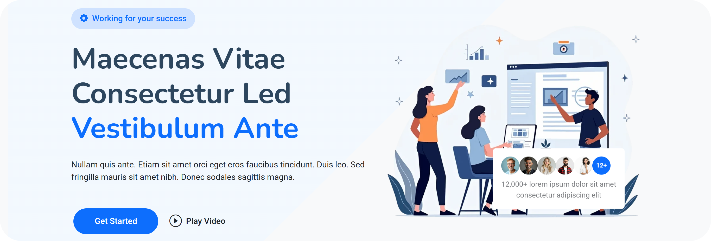

  
  
  
  

A Bootstrap-based landing page created as a practice project to apply responsive design concepts and improve layout-building skills.

<a href="https://bhavyuh.github.io/iLanding/">Preview</a>

## 📚 Table of Contents
- [Overview](#-overview)
- [Technologies Used](#-technologies-used)
- [Credits](#-credits)

## 🔍 Overview
iLanding is a simple and clean landing page built by following a real template for learning purposes (tried my best to make it identical)

## 🛠 Technologies Used
- HTML5
- CSS3
- Bootstrap 5

## 🙏 Credits
- Reference template: [iLanding demo template by BootstrapMade](https://bootstrapmade.com/demo/iLanding/)
